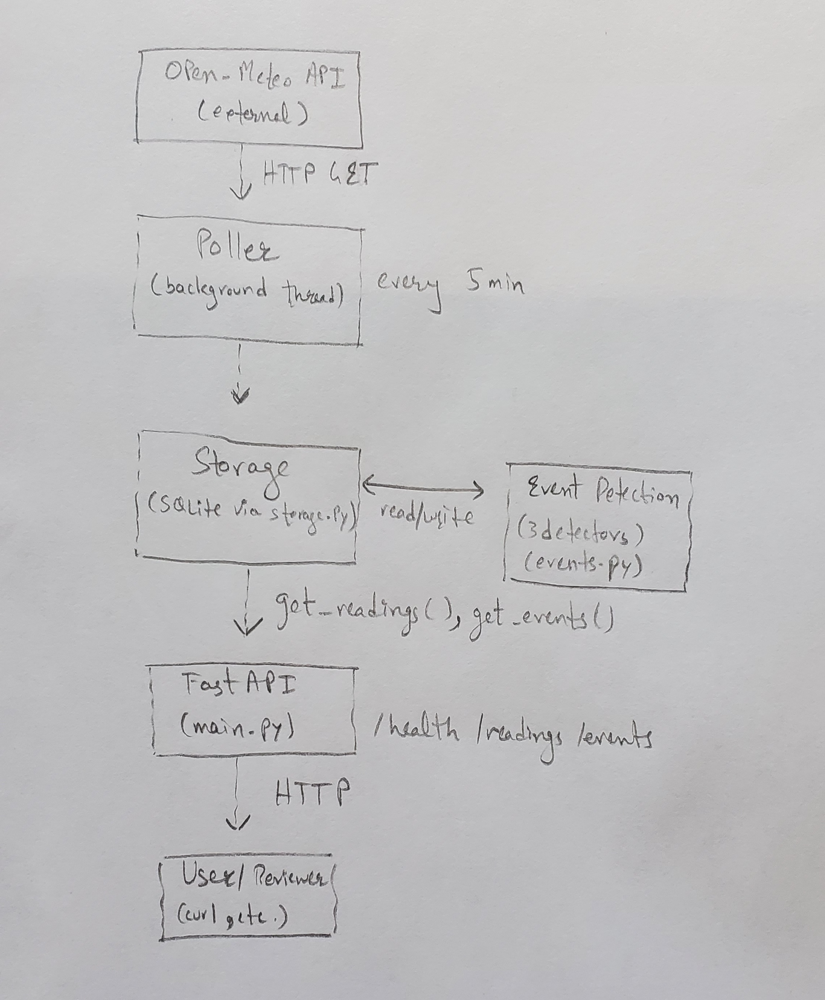

# watch-agent

# WatchAgent

A small backend service that polls live weather for Ottawa, Toronto, and Vancouver, decides when something worth noticing happened, and exposes both the raw readings and the detected events through an HTTP API.

Built as a take-home challenge focused on infrastructure and event-detection design. The interesting part of this project is not collecting the data, that part is easy. The interesting part is deciding what counts as a "notable" event as mentioned in challenge, which is what most of the design discussion below is about.

## What it does

Every five minutes, a background poller fetches the current weather for each of the three cities from the [Open-Meteo](https://open-meteo.com/) API. Each new reading is stored in a local SQLite database. After a reading is stored, three small detectors run on it to decide whether anything notable happened, a sharp temperature change, heavy rain, or a severe weather code from the WMO classification. Any event that fires is also stored in the database.

A FastAPI app exposes the data through three endpoints:

- `GET /health` — service status plus how many readings and events are in the database.
- `GET /readings?city=Ottawa&limit=50` — most recent readings, optionally filtered by city.
- `GET /events?city=Ottawa&limit=50` — most recent events, optionally filtered by city.

The poller runs in a background thread inside the same process as the API, so the whole thing is one container.

## Architecture



Explanation:

The poller and the API live in the same Python process. The poller runs on a background daemon thread started in FastAPI's `on_event("startup")` hook. They share the SQLite database, which is the only writer (the poller) and the only readers (the API and the analysis skill).

## Running it

### With Docker (the simplest way)

Docker is the recommended way to run this since it handles dependencies and the persistent volume automatically.

```bash
git clone https://github.com/aniqueali17/watch-agent
cd watch-agent
cp .env.example .env
docker compose up --build
```

The API is then reachable at `http://localhost:8000`. The poller starts automatically and stores its first three readings within a few seconds.

The SQLite database lives in a named Docker volume (`watchagent-data`), so it survives `docker compose down` and `docker compose up` cycles. The database is **not** committed to the repo.

To stop the service:

```bash
docker compose down
```

### Without Docker (for local development)

If you'd rather run it on the host directly:

```bash
python -m venv .venv
.venv\Scripts\activate          # Windows
# source .venv/bin/activate     # macOS / Linux
pip install -r requirements.txt
uvicorn app.main:app
```

The database file (`watch_agent.db`) will be created in the project root on first run.

### Running the tests

```bash
pytest -v
```

15 tests, covering deduplication, all three event detectors (positive and negative cases), and the API response shapes. Tests use isolated SQLite files via a fixture, never touch the real database, and never call the real Open-Meteo API.

## API reference

All endpoints return JSON. The base URL is `http://localhost:8000`.

### `GET /health`

Service liveness plus the current row counts.

```bash
curl http://localhost:8000/health
```

Returns:

```json
{ "status": "ok", "readings_stored": 3, "events_stored": 0 }
```

### `GET /readings`

Most recent readings, newest first. Both query parameters are optional.

```bash
curl "http://localhost:8000/readings"
curl "http://localhost:8000/readings?city=Ottawa"
curl "http://localhost:8000/readings?city=Ottawa&limit=10"
```

Returns:

```json
{
  "readings": [
    {
      "id": 1,
      "city": "Ottawa",
      "timestamp": "2026-06-01T10:30",
      "temperature_2m": 15.9,
      "apparent_temperature": 14.2,
      "precipitation": 0.0,
      "wind_speed_10m": 8.0,
      "weather_code": 0
    }
  ]
}
```

### `GET /events`

Most recent events, newest first. Both query parameters are optional.

```bash
curl "http://localhost:8000/events"
curl "http://localhost:8000/events?city=Toronto"
```

Returns:

```json
{
  "events": [
    {
      "id": 1,
      "city": "Toronto",
      "timestamp": "2026-06-01T15:00",
      "event_type": "temperature_swing",
      "reason": "Temperature dropped 6.3°C since previous reading (was 22.1°C, now 15.8°C)"
    }
  ]
}
```

### `GET /` and `GET /docs`

`GET /` returns a small landing payload listing the available endpoints. `GET /docs` is FastAPI's auto-generated interactive Swagger UI, useful for poking around in a browser.


## Event detection design

The challenge specifically warns that a detector firing whenever `temperature > 30°C` is "technically correct but intellectually shallow," and that a system with no events at all or events that never stop firing has missed the point. The goal is *selective* detection: events that a person reviewing the data would actually find worth knowing about.

I implemented three detectors. Each uses a different field of the payload and a different paradigm of detection, partly to demonstrate that good event detection picks the right method for the signal type, rather than applying one rule everywhere.

### Detector 1: temperature swing

**Rule.** Fire when temperature differs by more than 5°C from this city's previous stored reading, *and* the previous reading is within the last 90 minutes.

**Why this design.** Temperature has natural daily drift, sun coming up warms things, sun going down cools them. A naive "fire on any 5°C change" detector would fire on slow morning warmups (15°C → 20°C over two hours), which is not a weather event, it's just sunrise. The 90-minute window restricts the detector to *rate of change*, not absolute change over arbitrary time. A 5°C shift within an hour is meaningful (a cold front rolling in, a thunderstorm cooling the area, a sea breeze hitting); the same shift over six hours is not.

**Why 5°C and not a different number.** 5°C aligns roughly with what meteorologists call a "significant temperature change" between consecutive hourly readings. Smaller (3°C) starts firing on normal drift; larger (8°C) misses real fronts. There is no objectively perfect number; this is a defensible middle.

**Edge cases handled.** The first reading for a city has no history, the detector silently returns `None`. Both directions trigger (rises and drops), and the reason string distinguishes them.

### Detector 2: heavy precipitation

**Rule.** Fire when `precipitation` (mm in the past hour) exceeds 7 mm.

**Why this design, and why an absolute threshold here.** Unlike temperature, "what counts as heavy rain" doesn't really differ between Ottawa and Vancouver. Heavy rain is heavy rain. The WMO and most national weather services classify rainfall as: light below 2.5 mm/h, moderate 2.5 to 7.6 mm/h, heavy above 7.6 mm/h. The 7 mm threshold sits right at the boundary of "heavy," firing on conditions a person would actually notice (commute disruption, pooling water) without being so extreme it almost never fires.

This is a deliberate departure from city-relative thresholds. Because the field has objective physical meaning agreed by domain experts, making it city-relative would be over-engineering. Knowing when to use absolute vs relative thresholds is the design judgment.

**Edge cases handled.** Open-Meteo occasionally reports `null` for precipitation when it isn't raining. The detector treats `None` as no rain and returns `None`, instead of crashing on a `None < 7` comparison.

### Detector 3: severe weather code

**Rule.** Fire when `weather_code` is in a defined severe set: 65 (heavy rain), 75 (heavy snow), 82 (violent rain showers), 86 (heavy snow showers), 95 (thunderstorm), 96 (thunderstorm with slight hail), 99 (thunderstorm with heavy hail).

**Why this design.** Open-Meteo uses WMO weather codes, which is a standardized international classification with hundreds of countries' meteorological agencies behind it. Trusting WMO's own categories is more defensible than inventing my own. Light drizzle (code 51) and light snow (code 71) are deliberately excluded, those would fire constantly in places like Vancouver in winter and the goal is selective detection.

### Detectors I considered and rejected

A number of detectors that sound interesting in principle can't actually be implemented with Open-Meteo's `current` payload, and a detector that *claims* to fire on data it can't see is worse than no detector. Specifically:

- **Lightning, barometric pressure, UV index, solar radiation, humidity, soil moisture, wind gusts (peak vs. average)**: not in the `current` payload.
- **Multi-day heatwaves and cold snaps**: would require historical baseline data the system doesn't accumulate within the scope of this challenge.
- **Forecast-based commute warnings**: we poll *current* conditions, not forecasts.

These are mentioned here so the gap between "what would be nice" and "what's actually possible with the data" is explicit.

### Where event dedup happens

Events are only generated when a *newly stored* reading is detected, not when a duplicate is rejected by storage. The contract is enforced at the caller: `poller.poll_once` only calls `events.detect_and_store` when `storage.insert_reading` returned `True`. Combined with the `UNIQUE(city, timestamp)` constraint on readings, this means the same reading can never produce the same event twice.

## Cursor setup

The `.cursor/` folder configures Cursor's AI for this specific project. It has three parts: rules, an agent, and a skill. Each one is scoped to a real decision or workflow in this codebase, not generic AI advice.

### Rules

Three rules live in `.cursor/rules/`. Each encodes a real engineering decision and is enforceable by reading the code.

**`storage-isolation.mdc`** — only `app/storage.py` runs SQL or imports `sqlite3`. Other modules go through storage functions. This keeps the schema and connection logic in one place and makes refactors safe. The data-analysis skill is the one documented exception, since it runs as a standalone script outside the `app/` package.

**`poller-resilience.mdc`** — the polling loop must never crash because of one failed city. HTTP errors are caught inside `fetch_city`, logged at `WARNING` with the city name, and the function returns `None`. The loop checks for `None` and continues. Logging severity is specified: `INFO` for stored readings, `DEBUG` for duplicates (the common case since Open-Meteo updates hourly but we poll every five minutes), `WARNING` for fetch failures.

**`event-reasons.mdc`** — every event stored to the database has a `reason` field that is a complete sentence containing the relevant numbers and (for swings) both the previous and current values. Vague placeholders like "event detected" are not allowed. The reason field is what someone reading the `/events` endpoint actually sees, and it carries most of the explanatory weight.

### Agent

`.cursor/agents/event-reviewer.md` defines an "Event Detection Reviewer" agent. Its only job is to evaluate proposed changes to `app/events.py` against the existing design. The system prompt loads the agent with real context: the three current detectors, their thresholds, and the reasoning behind each (why the 90-minute window exists, why absolute vs relative thresholds, which WMO codes are in the severe set).

The agent reviews proposed detector changes against five criteria: selectivity, field appropriateness, reason quality, non-overlap with existing detectors, and edge cases. It explicitly does *not* review SQL, the API, the poller, or Docker, those are out of scope. It surfaces issues and asks the developer to defend their choice rather than approving or rejecting.

This agent exists because event detection is the part of the codebase where bad changes (a detector that fires every five minutes, an absolute temperature threshold) would silently degrade the system without breaking any test. A scoped reviewer catches those before they merge.

### Skill

`.cursor/skills/analyze.py` is an executable Python script the Cursor agent can invoke as a tool. It takes a question as a command-line argument, queries the SQLite database, and returns structured JSON.

It supports four analyses, each using a different style of query:

- **Per-city summary** (`"summary for Ottawa"`) — min, max, and average for temperature, precipitation, and wind over the last 24 hours
- **Cross-city comparison** (`"compare cities"`) — side-by-side averages for all three cities, with the biggest temperature gap called out separately
- **Recent events** (`"recent events"` or `"events for Toronto"`) — events from the last 24 hours, with a count breakdown by event type and the full reason list
- **Trend** (`"trend for Vancouver"`) — last 24 readings for a city in chronological order, plus a direction callout (rising, falling, steady) with a 1°C floor so normal fluctuation isn't called a trend

The output is always wrapped in a standard envelope: `question`, `interpretation`, `result`. The `interpretation` field makes the script's pattern matching transparent so the caller knows what the script understood.

**A design choice worth naming.** Pattern matching was chosen over LLM-based parsing because it makes the skill run offline, requires no API keys, produces deterministic output that's auditable, and works in CI. An LLM parser would be more flexible but adds dependencies, costs money, and would fail in environments without internet access.

**Read-only by design.** The skill reads the same SQLite database the app writes to, but it never polls Open-Meteo, never inserts rows, and never updates anything. The app is the only writer; the skill (and the API) are the only readers. If the database is empty or missing, the skill returns a "no data" message rather than fetching its own.

**How to run.** The skill reads the same SQLite database the app writes to. The simplest way is to run the app locally with `uvicorn app.main:app`, let the poller collect a few readings, then in a separate terminal run:

​```bash
python .cursor/skills/analyze.py "compare cities"
​```

The skill is intentionally a development and inspection tool, not part of the runtime container. The `.cursor/` folder is excluded from the Docker image via `.dockerignore` because rules, agents, and the analysis skill configure how Cursor's AI works on the project, not the production service.

## Technology choices

| Choice | Why |
|---|---|
| **FastAPI** | Modern Python web framework, async-friendly, automatic OpenAPI docs at `/docs`, declarative query-parameter validation via the `Query` helper |
| **SQLite via the built-in `sqlite3` module** | Single-file database that requires no separate server, ships with Python so it adds nothing to `requirements.txt`, persists trivially via a Docker volume. Postgres would be overkill for one writer and a few readers |
| **httpx** | Modern HTTP client that pairs cleanly with FastAPI and supports both sync and async. Used for the one outbound call to Open-Meteo |
| **uvicorn** | The ASGI server FastAPI is designed for. Binding to `0.0.0.0` inside the container is mandatory so the port is reachable from outside |
| **pytest** | Standard Python testing framework. Combined with a `temp_db` fixture in `tests/conftest.py`, every test runs against an isolated SQLite file |
| **Threading (not async) for the poller** | `threading.Thread(daemon=True)` started in FastAPI's startup hook. Simpler than introducing an async task scheduler for a single polling loop. `daemon=True` ensures the thread dies cleanly on shutdown |
| **Docker named volume (not bind mount) for persistence** | Works identically on Windows, macOS, and Linux without path differences. Docker manages the storage location, so the volume "just works" on a reviewer's machine without local folder setup |

## Storage and deduplication

Storage is the foundation of the project, so a few specific decisions worth naming:

- **`UNIQUE(city, timestamp)` constraint on the readings table.** Combined with `INSERT OR IGNORE` in `storage.insert_reading`, this enforces deduplication at the database level rather than in application code. The function returns `True` if a row was actually inserted, `False` if the constraint silently rejected it as a duplicate. Open-Meteo only updates readings hourly but the poller runs every five minutes, so most polls return data we already have, this is the design that handles that without per-call Python checks.
- **Five separate columns for weather fields** rather than a single JSON blob. Makes per-field queries (averages, comparisons, filtering) trivial without parsing.
- **No dedup on the events table.** If detection fires the same event twice that's a logic bug to find, not something storage should silently swallow.
- **`DB_PATH` is configurable via environment variable** with a sensible local default. The Dockerfile sets `DB_PATH=/data/watch_agent.db` to point at the mounted volume; outside Docker it falls back to a file in the working directory. Same code, two environments.

## Known caveats

A few honest notes about things I'd do differently with more time:

- **The poller depends on a successful startup.** If Open-Meteo is unreachable at boot, the poller still starts, but the first cycle fails silently aside from a WARNING log. A health check that surfaces "poller has not stored anything in the last N minutes" would catch this.
- **FastAPI's `on_event("startup")` hook is deprecated** in newer versions in favor of the lifespan pattern. The current hook still works and produces a deprecation warning. Refactoring to lifespan is mechanical but I left it as-is because the deprecation hasn't been removed and the change is risk-without-payoff for this scope.
- **The temperature-swing detector depends on stored history**, which means a long gap (e.g. the service was down for a few hours) might cause the first reading on resumption to miss what was actually a sharp change. A short in-memory rolling buffer per city would catch this, at the cost of additional complexity.
- **The analysis skill assumes the app has run.** It reads from the database the app writes to, so an empty database produces a "no data" message rather than a stack trace, but the user must run the app at least once to populate it. This is intentional, the skill is a query tool, not a poller, but worth flagging.